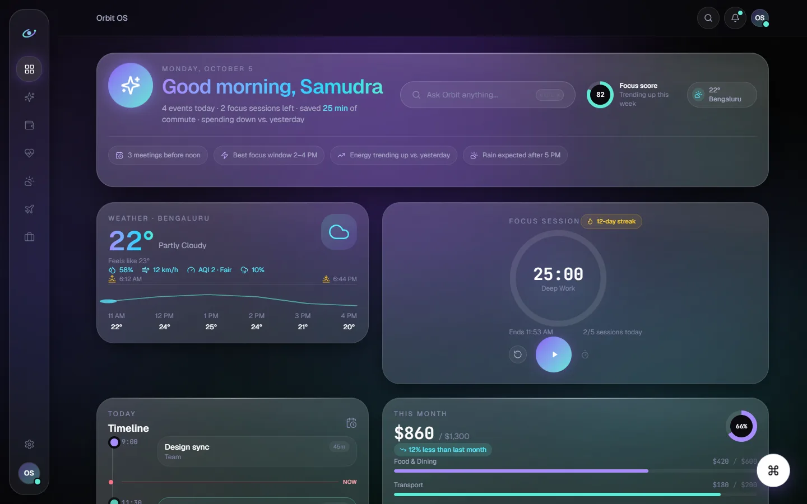
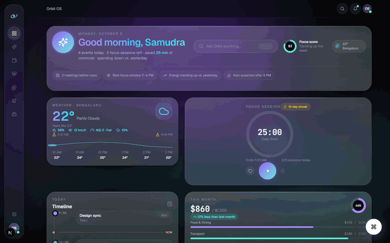
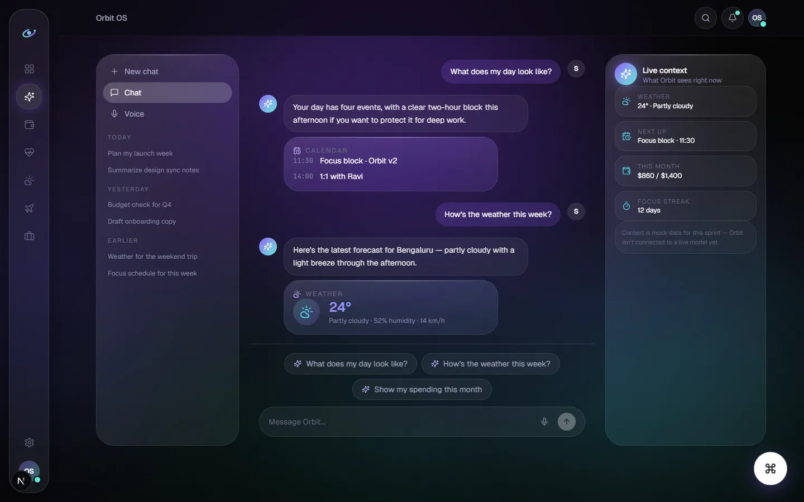
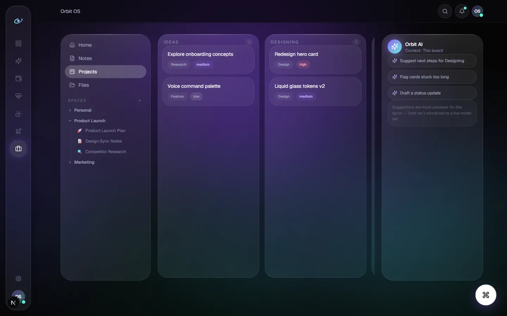
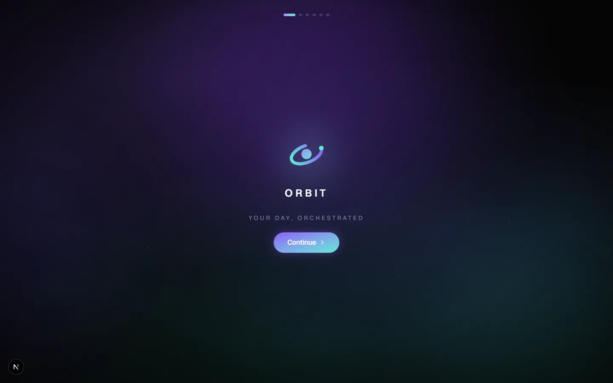
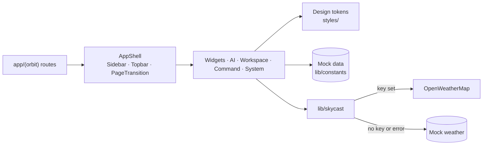

<div align="center">



<br />

     

<br />

**[Run it](#run-it)** &nbsp;·&nbsp; **[Features](#features)** &nbsp;·&nbsp; **[Design system](#design-system)** &nbsp;·&nbsp; **[Architecture](#architecture)** &nbsp;·&nbsp; **[Installation](#installation)**

</div>

---

<p align="center">
  
</p>

Orbit OS is an interface exploration, not a real operating system. It asks what a personal dashboard would feel like if it borrowed from operating-system design (a persistent shell, a command palette, a notification center, a workspace of notes, files and projects, an AI surface) instead of dashboard templates. The look is a dark "Liquid Spatial UI": translucent glass panels, spring motion and a purple and cyan identity.

Most of the data is mocked, and the screenshots below show that mock data. Only the weather views can call a live API, and even they fall back to mock data without a key.

## Run it

```bash
git clone https://github.com/Samudra-GITHub/orbit-os.git
cd orbit-os && npm install && npm run dev
```

Then open <http://localhost:3000/dashboard>, or press the floating ⌘ button to open the command palette.

<p align="center">
  
</p>

## Features

<table>
  <tr>
    <td width="50%" valign="top">
      
      <h3>A desktop of widgets</h3>
      <p>Greeting, weather, finance, health, a focus timer, a music player, a calendar timeline and an AI insight card, each an independent glass panel.</p>
    </td>
    <td width="50%" valign="top">
      
      <h3>An AI workspace</h3>
      <p>A chat canvas with inline widget cards, a conversation sidebar, a live context panel and a voice orb. Replies are scripted mock data, and the UI says so.</p>
    </td>
  </tr>
  <tr>
    <td width="50%" valign="top">
      
      <h3>Notes, files and projects</h3>
      <p>A notes editor, a file explorer with preview, and a Kanban project board, organised into spaces.</p>
    </td>
    <td width="50%" valign="top">
      
      <h3>Onboarding and a brand</h3>
      <p>A multi-step welcome flow, a logo set and favicons generated by <code>scripts/generate-icons.mjs</code>. Brand guidance is in <a href="docs/branding.md">docs/branding.md</a>.</p>
    </td>
  </tr>
</table>

**Also:** a command palette with fuzzy search, suggestions and recent commands; a notification center and toasts; weather from OpenWeatherMap with mock fallback; spring-based motion with `prefers-reduced-motion` handled globally.

## Design system

The rules that keep the interface coherent are written down in [docs/design-bible.md](docs/design-bible.md): tokens over hardcoded colour, one shell for every screen, spring motion and no abrupt transitions, and a dark theme only. Colour, motion, radius, shadow and spacing tokens live in `styles/`, with the Tailwind v4 `@theme` block in `styles/globals.css`.

## Tech stack

| Layer | Technology |
| :-- | :-- |
| Framework | Next.js 16 (App Router), React 19, TypeScript 5 |
| Styling | Tailwind CSS 4 with `@theme` tokens, `clsx`, `tailwind-merge` |
| Motion | Framer Motion, GSAP (cinematic moments only) |
| UI | Lucide icons, Recharts, `@radix-ui/react-slot` |
| Tooling | Prettier with the Tailwind plugin; `sharp` and `png-to-ico` for icon generation |

## Architecture



Every route under `app/(orbit)/` shares one layout built on `AppShell`. Components consume design tokens instead of hardcoded colours. The weather layer in `lib/skycast/` decides in one place between a live OpenWeatherMap call (revalidated every 10 minutes) and mock data, so widgets never need to know which they received.

```text
orbit-os/
├── app/            (orbit)/ dashboard, ai/ (chat, voice), weather, workspace/ (notes, files, projects); onboarding
├── components/     layout, ui, widgets, ai, command, workspace, system, motion, ...
├── lib/            constants/, hooks/, skycast/ (weather client, parsers, mock data)
├── styles/         globals.css plus colour, motion, radius, shadow and spacing tokens
├── public/         branding assets, web manifest
├── scripts/        generate-icons.mjs
└── docs/           design-bible.md, branding.md, screenshots
```

## Installation

Requires Node.js and npm.

```bash
npm install
```

| Command | What it does |
| :-- | :-- |
| `npm run dev` | Start the dev server on port 3000 |
| `npm run build` | Production build |
| `npm run start` | Serve the production build |
| `npm run lint` | Run the lint script |

### Environment

| Variable | Required | Purpose |
| :-- | :-- | :-- |
| `OPENWEATHER_API_KEY` | No | Live weather. Without it the weather widget and page use mock data. |

Copy `.env.example` to `.env.local` to set it.

### Deploy

No deployment configuration is included. It is a standard Next.js app (`npm run build`, then `npm run start`).

## Limitations

- Finance, health, calendar and AI content is mock data.
- Workspace layouts are not persisted.

## License

[MIT](LICENSE).
